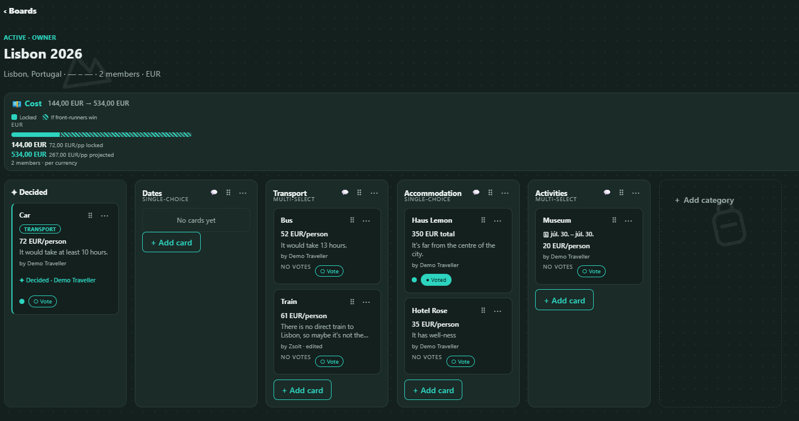
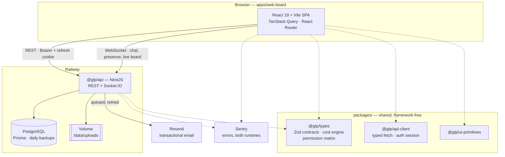
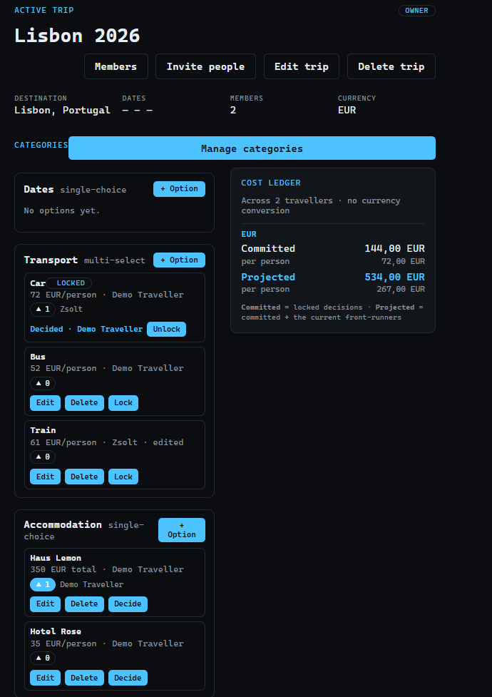
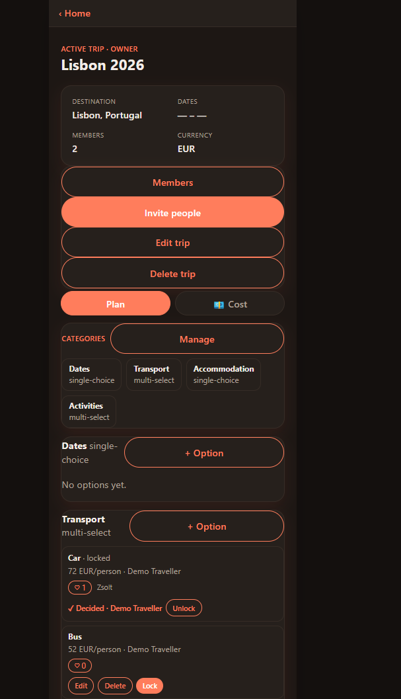

# Group Trip Planner

**Deciding where to go, together — without the 400-message group chat.**

A full-stack web app for planning a trip as a group: propose options
(accommodation, transport, dates, activities), compare them side by side, gather
sentiment through **advisory voting**, and record explicit, audited **decisions**
— with a live per-currency cost picture of what you have committed to and what
you are heading towards.

🔗 **Live demo:** <https://trips.zsoltpinter.dev> ·
📸 Screens below · 🧭 [Three UIs explored](#three-uis-one-backend--the-design-exploration)



---

## The four decisions worth reading about

Most of this app is ordinary CRUD. These four parts are not, and they are the
reason the rest of it holds together.

### 1. Voting is advisory, not binding

A vote is a **signal**, never a state transition. No amount of votes locks
anything in; an Organizer records the decision explicitly, and the audit trail
says who decided and when. Groups do not actually want majority rule — they want
to know what everyone thinks and then have someone call it.

The consequence that had to be designed rather than assumed: a vote can go
**stale**. If someone edits an option's price after you voted for it, your vote
was cast on different information. That is surfaced, not silently carried over.

### 2. A decision is an atomic compare-and-set, and the guard depends on the category

Two organizers clicking "decide" at the same moment is the correctness question
this app exists to answer, and the answer is a conditional write — but **which**
version guards it depends on what kind of category it is:

| Category type     | Guarded by             | Race that gets rejected                            |
| ----------------- | ---------------------- | -------------------------------------------------- |
| **multi-select**  | the option's version   | two organizers locking **the same** option         |
| **single-choice** | the category's version | two organizers locking **different** options in it |

In a single-choice category the write also unlocks the previous winner inside the
same transaction, because only one decision can stand. The client sends both
versions it last saw and the server picks; the rule never leaks into the
frontend. A rejected lock is a `409` and — uniquely in this app — the UI does
**not** optimistically flip: you are shown who won, not a state that is about to
be taken back. See [`packages/types/src/locking.ts`](packages/types/src/locking.ts).

### 3. Authorization is never in the token

The access token carries authentication claims only. Every request re-loads the
user from the database, and every trip-scoped route resolves permissions from the
requester's **membership row for that trip**: `JWT → TripContext → Permission`.

That means a role change or a removal takes effect on the _next request_, not
whenever a 15-minute token happens to expire. It also means a non-member gets a
`404`, not a `403` — a `403` confirms the trip exists. Nested resources are
always re-scoped to their parent (`{id, tripId}`, `{id, categoryId}`), so a valid
id from one trip cannot be used against another. A self-maintaining test reads
Express's own route table and fails if a new route ships without a guard.

### 4. The cost engine is pure, and refuses to convert currencies

[`packages/types/src/cost.ts`](packages/types/src/cost.ts) has no Prisma, no
Nest, and no clock — every input is passed in. The HTTP endpoint is a thin
adapter over it, which is what makes it the app's headline unit-test suite.

It draws one distinction that turns out to be the whole point:

- **Committed** — the exact total of options the group has actually decided on.
- **Projected** — committed _plus the current front-runner_ of every category
  still open. "If today's front-runners win, here is the bill."

Totals are kept **per currency and never summed across them**. A number produced
by an invented exchange rate looks authoritative and is wrong; four options in
three currencies is an honest answer.

---

## Architecture



**One contract, three consumers.** The Zod schemas in `@gtp/types` are the
single definition of every request and response, imported by the API _and_ the
frontend. Renaming a field breaks the build on both sides in the same commit —
which is exactly what you want, and was verified deliberately rather than
assumed. The cost engine and the permission matrix live there too, so the rules
are the same objects the server enforces and the UI reads.

**What runs where.** Everything the browser must not be trusted with — locking,
permissions, staleness, cost aggregation, rate limits — is on the server. The
shared package holds the _definitions_; the API holds the _enforcement_.

---

## Feature tour

|                          |                                                                                                                                                |
| ------------------------ | ---------------------------------------------------------------------------------------------------------------------------------------------- |
| **Trips & roles**        | Owner / Organizer / Traveller / Guest, with a permission matrix that both sides read. Lifecycle: Draft → Active → History, with an expiry job. |
| **Options & categories** | Drag-ordered category lanes, per-category option fields, single-choice vs multi-select, an undeletable Dates category.                         |
| **Advisory voting**      | Vote counts, front-runners, staleness when an option changes underneath a vote.                                                                |
| **Decisions**            | Drag a card to **Decided** — an atomic, audited, category-aware lock.                                                                          |
| **Cost dashboard**       | Committed vs projected, per currency, per person vs group, with fixed and dynamic headcounts.                                                  |
| **Real-time**            | Socket.IO chat with @mentions, reactions, unread counts, per-category channels, and a hybrid reconnect that recovers missed messages.          |
| **Notifications**        | In-app bell plus a queued, deduplicated, retried email pipeline with one-click HMAC unsubscribe and per-trip mute.                             |
| **Invites**              | Signed invite links that survive a logged-out click through both email/password _and_ Google sign-in.                                          |
| **Media**                | Cover images and avatars: magic-byte sniffing → `sharp` re-encode (EXIF and GPS gone) → random name → storage behind a driver seam.            |
| **Account**              | Google OAuth, email verification, GDPR erasure that anonymises in one transaction, transfers owned trips, and purges the uploaded bytes.       |

---

## Engineering quality

The posture is **demonstrative**: strong, real examples at each level rather than
a coverage percentage.

|                 |                                                                                                                                                                                       |
| --------------- | ------------------------------------------------------------------------------------------------------------------------------------------------------------------------------------- |
| **Tests**       | 390 API tests (`node:test` against a real Postgres) · 76 board tests (Vitest) · 3 Playwright browser journeys — all CI-gating. [`docs/test-strategy.md`](docs/test-strategy.md)       |
| **Security**    | OWASP sweep with findings and _accepted risks_ written down. [`docs/security-audit.md`](docs/security-audit.md)                                                                       |
| **Performance** | Index audit driven by asking the database, not reading the schema; N+1 tests that assert _shape_ rather than a magic number. [`docs/performance-audit.md`](docs/performance-audit.md) |
| **UI**          | Four-state review, one focus-trapping modal, a committed token contract. [`docs/ui-audit.md`](docs/ui-audit.md)                                                                       |

A recurring habit in these: **a fix is not accepted until the test has been
watched to fail without it.** That is how the audits found that socket message
sending had no rate limit at all, that twelve foreign keys were unindexed
(Postgres never indexes one for you), and that Sentry's `sendDefaultPii: false`
does not stop it sending a plaintext password.

---

## Three UIs, one backend — the design exploration

Phases 0–3 were deliberately built as **three genuinely different front-ends on
one shared NestJS backend** — an exercise in UI-paradigm design, and in keeping
business logic in shared, framework-agnostic packages rather than in a component
tree. At the end of Phase 3 they were compared on the same seeded trip and
**converged to one**. The other two are **frozen** in the repo as evidence of the
exploration — still readable, no longer built, linted or tested.

The screenshots below are the same trip, the same data and the same locked
decision, so the numbers agree across all three.

### 🏆 Trip Board — the product (`apps/web-board`)

A spatial planning **canvas**: categories are columns, options are cards, and you
**drag a card onto the "Decided" column to record the group's decision**. It won
because it makes the app's central idea — comparing options, then committing to
one — a physical gesture rather than a form field, and because the cost strip
sits beside the thing you are about to decide.


### Command Deck — frozen (`apps/web-deck`)

A keyboard-first **console**: a ⌘K command palette, dense option rows, a
persistent right-rail cost ledger. Fastest of the three to operate, and the
hardest to walk up to.



### Trip Feed — frozen (`apps/web-feed`)

A mobile-first **social feed**: option cards in a scrollable stream, tap-to-vote,
a Plan / 💶 Cost tab switch. The most natural on a phone, but it makes options
sequential when the task is to compare them.



---

## Stack

- **Monorepo** — pnpm workspaces + Turborepo
- **Backend** — NestJS · Prisma · PostgreSQL · Socket.IO · Zod at every boundary
- **Frontend** — React 19 · TypeScript · Vite · TanStack Query · dnd-kit ·
  CSS custom-property token contract, light and dark
- **Shared** — `@gtp/types` (contracts, cost engine, permissions),
  `@gtp/api-client` (typed fetch + auth session), `@gtp/ui-primitives`
- **Auth** — short-lived access JWT + rotating, server-stored refresh token
  (reuse revokes the family) · Google OAuth · argon2id
- **Ops** — Railway · Docker · GitHub Actions · Sentry · Resend
- **Testing** — `node:test` + supertest against a real Postgres · Vitest ·
  Playwright

---

## Development

Requires **Node 22** and **pnpm 9** (pinned via `packageManager`), plus Docker
for the database.

```bash
pnpm install

# Postgres 16 on :5432 (credentials match the .env.example connection string)
docker compose up -d db

cp apps/api/.env.example apps/api/.env    # then set JWT_SECRET
pnpm --filter @gtp/api db:migrate:deploy  # apply migrations
pnpm --filter @gtp/api db:seed            # optional demo user

pnpm --filter @gtp/api dev                # API      → http://localhost:3000
pnpm --filter @gtp/web-board dev          # Trip Board → http://localhost:5175
```

Without a `RESEND_API_KEY`, verification and invite links are written to the API
log instead of being emailed — which is what you want locally.

The full gate, the same one CI runs:

```bash
pnpm lint && pnpm typecheck && pnpm build && pnpm test
pnpm --filter @gtp/e2e run test:e2e       # Playwright journeys
```

`web-deck` and `web-feed` are frozen and excluded from all four; they are kept
for the design exploration above.

---

## Deployment

Three Railway services — managed Postgres, the NestJS `api`, and the `web-board`
SPA behind Caddy — each built from a committed Dockerfile. Migrations run when
the API container starts; merging to `main` deploys, but only after CI has passed
on that commit.

The full runbook — environment matrix, the cross-site cookie/CORS wiring, the
volume that uploads depend on, backups, monitoring and teardown — is in
[`DEPLOY.md`](./DEPLOY.md).

## License

All rights reserved.
